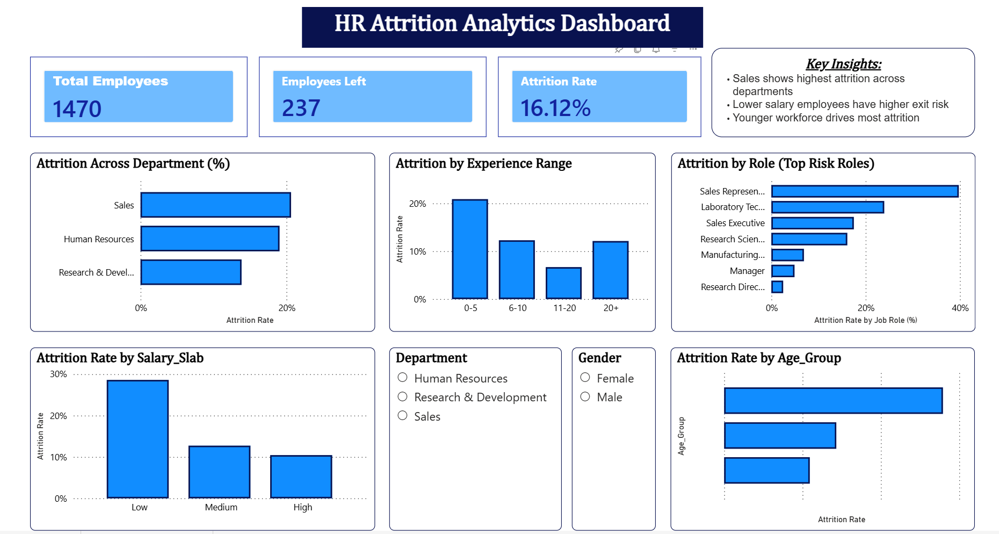

# HR Attrition Analysis Dashboard

## Overview
This project analyzes employee attrition patterns using Power BI and Excel. The dashboard focuses on attrition trends across departments, job roles, salary bands, years at company, and age groups.

## Objective
The aim of this project is to identify key factors contributing to employee attrition and present the findings in a simple, interactive dashboard format.

## Tools Used
- Power BI
- Excel

## Files Included
- HR_Attrition_Data.xlsx
- HR_Attrition_Dashboard.pbix
- dashboard-preview.png

## Key Insights
- Sales department shows the highest attrition compared to other departments.
- Lower salary bands are associated with relatively higher attrition.
- Employees in the early stage of their careers show higher attrition.
- Some job roles have noticeably higher exit rates than others.

## Dashboard Preview

